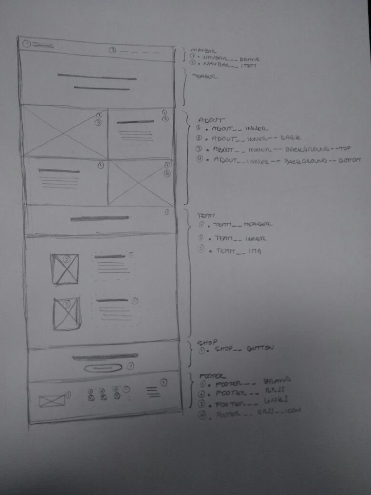
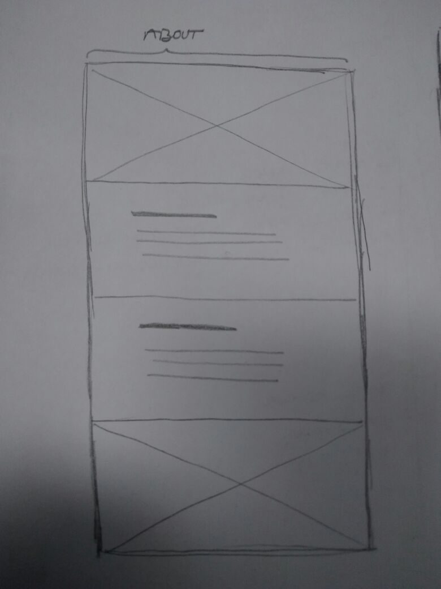
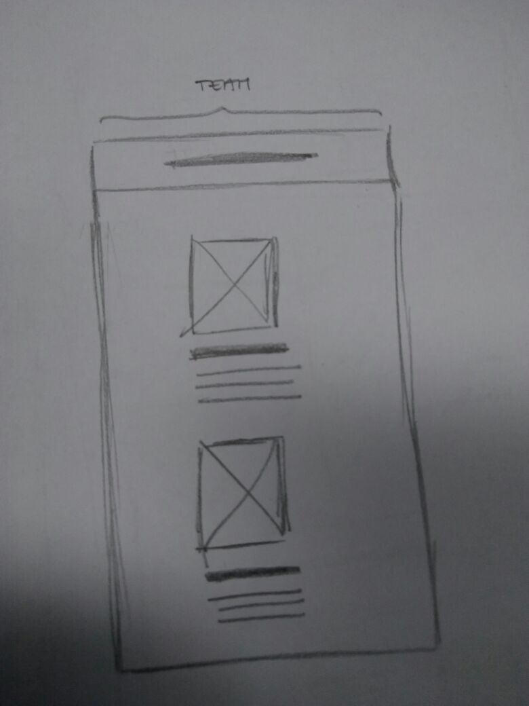
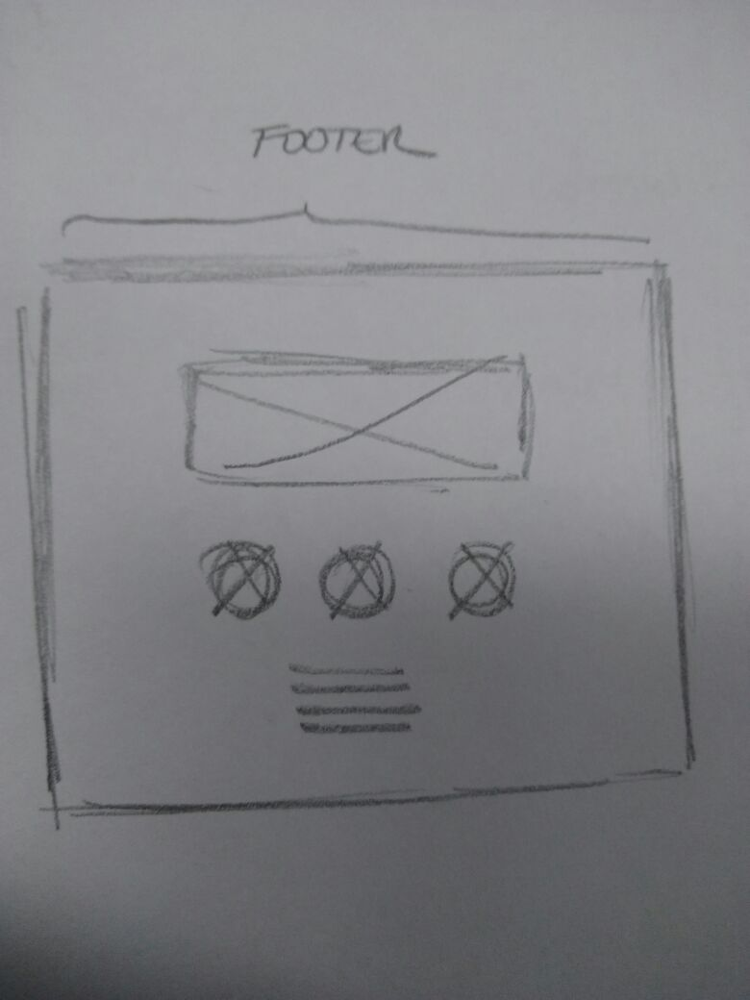

# DESAFÍO 09

## REQUISITOS

### Requisitos Generales:

- Crear una página web de tipo landing page que contenga:
  - Una barra de navegación
  - Un header
  - 3 Secciones:
    1. Sección con información acerca de la empresa
    2. Sección con información acerca del equipo
    3. Sección donde se invita a comprar el producto
  - Un footer
- Debe ser responsive

### Requisitos Específicos:

- Secciones con grilla &rarr; *usar bootstrap*
- Íconos de redes sociales con contenedor redondo &rarr; *usar font-awesome*
- Párrafos sin contenido &rarr; *usar extracto de "La Metamorfosis"*

### Requisitos Visuales:

- Layout:
  - Utilizar Bootstrap

- Fuentes:
  - Títulos: Raleway-ExtraLight y Raleway-Bold
  - Párrafos y otros: OpenSans

- Colores:
  - Letras: #686963
  - Letras-light: #FFFFFF
  - Background: #FAFAFA
  - Background-header: #E56353
  - Background-dark: #707070
  - Background-footer: #686963
  - Botones: #FAFAFA

- Imágenes:
  - Se encuentran dentro de la carpeta entregada por el cliente

- Íconos:
  - Buscar similares al mock-up en "font-awesome"

## SKETCH

### Versión desktop:
  
### Versión mobile:

  - Sección "About"
    
  - Sección "Team"
    
  - Sección "Footer"
    
